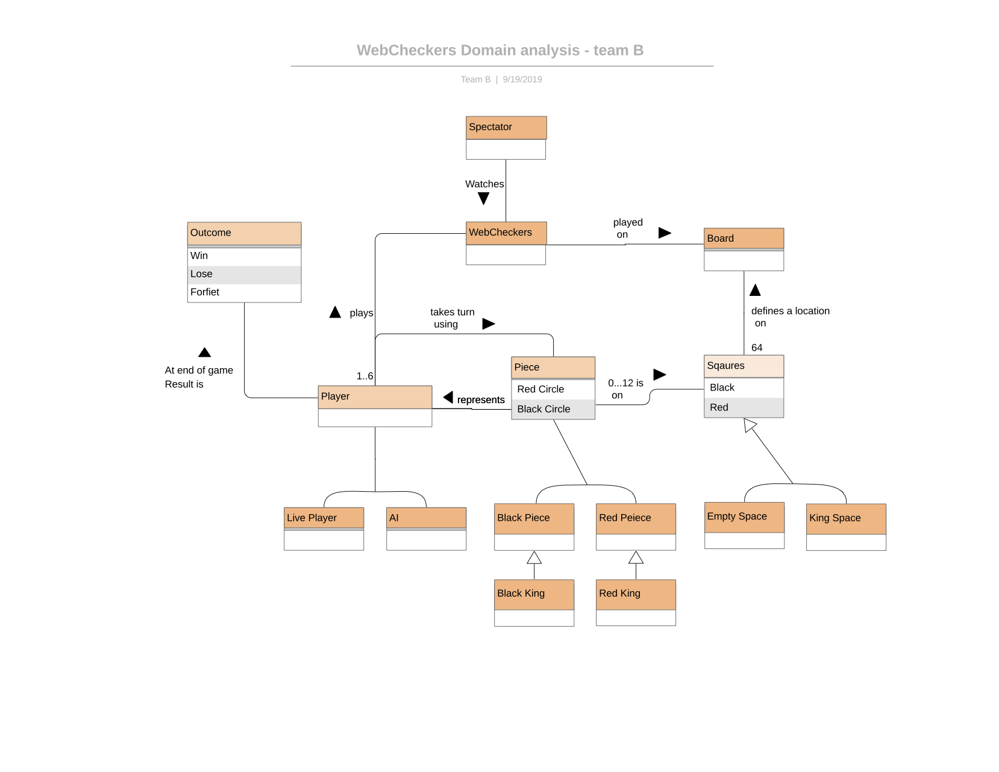
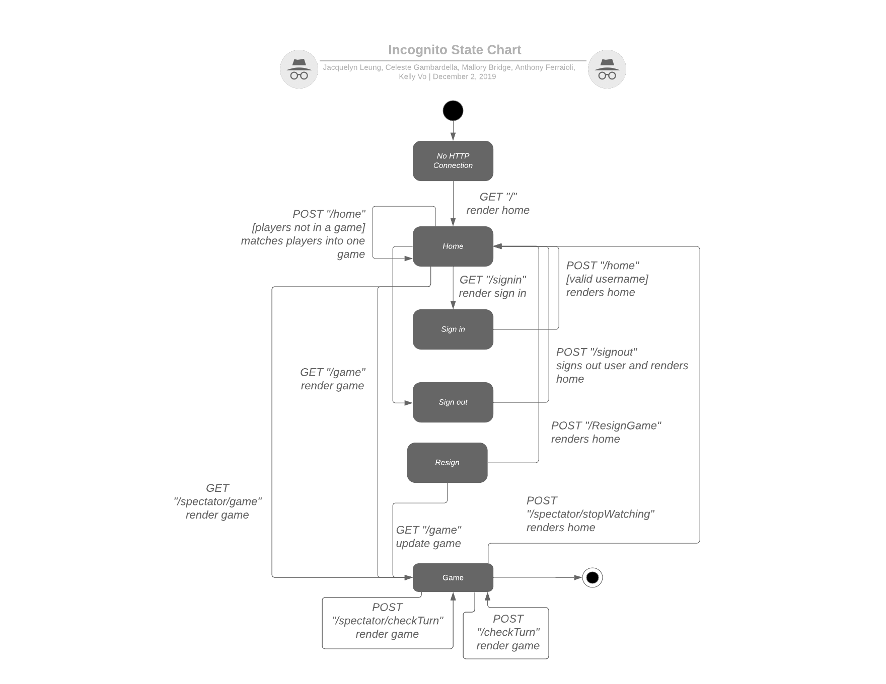
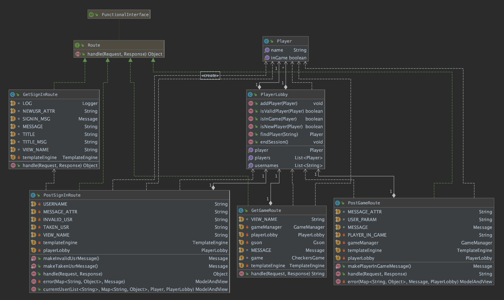

# PROJECT Design Documentation

## Team Information
* Team name: Incognito - 11b
* Team members
  * Jacquelyn Leung
  * Mallory Bridge
  * Anthony Ferraioli
  * Celeste Gambardella
  * Kelly Vo

## Executive Summary

WebCheckers is a webapp to play a game of checkers with other people.
You have the option to watch games live or play games against others.

### Purpose
> The purpose of the project is to work together in an agile team and create a game of WebCheckers.

### Glossary and Acronyms

| Term | Definition |
|:------:|:------------:|
| VO | Value Object |
| UI | User Interface |
| AI | Artificial Intelligence |
| OS | Operating System |
| HW | Hardware |

## Requirements

This section describes the features of the application.

>Sign In
>* When a player is not signed in they have the option to sign in.
>* If a player chooses to sign in they are redirected to a sign in page
>* The sign in page displays two text boxes one for a username and password
>* When the sign in button is clicked we check to see if a valid username and
> password was entered.
>* If there is an invalid username or password an error message will be displayed.
>* When a valid username and password is entered the user will be redirected back to
> the homepage.
>* A user will be able to see other players logged if they are logged in otherwise they
> will just see the number of players available.
>
>Start a Game
>* A user will be able to select a player to start a game if they are logged in.
>* If the player selected is in a game already then the user will see an error message.
>* If a user selects a player not in a game then that player and user will both be redirected
> back to game view.
>* A player will be only be able to drag and drop a piece on valid spaces.
>* A player will only be able to move there pieces.
>
>_In this section you do not need to be exhaustive and list every
> story.  Focus on top-level features from the Vision document and
> maybe Epics and critical Stories._

### Definition of MVP

> Where developers provide the smallest amount of features to help satisfy new customers and
> get feedback for new enhancements that can be implemented in future product development.

### MVP Features

>* Sign In
>* Start Game
>* Sign Out
>* Resignation
>* Game Play
>* Spectator Mode
>* AI

### Roadmap of Enhancements

>1. Sign In
>2. Start Game
>3. Sign Out
>4. Resignation
>5. Game Play
>6. Spectator Mode
>7. AI

## Application Domain

This section describes the application domain.

> Provides a common understanding between a customer and the developers
> of the scope and major entities that exist in the system.
>
> We have created our domain model in hopes to help the customer understand
> what we was trying to accomplish as we begin our development process. 
>
> Within our domain model we have included the following elements:
>
>  ***Domain Model Overview***
>   > * Spectator that watches the WebCheckers game
>   > * WebCheckers game that is played on a Board
>   > * Squares that defines a location on the Board
>   > * Piece(s) that are on a Square
>   > * Piece that represents a player
>   > * Player taking turns using a Piece
>   > * Player playing WebCheckers
>   > * Player getting end of game result

## Architecture and Design

This section describes the application architecture.

### Summary

The following Tiers/Layers model shows a high-level view of the webapp's architecture.

As a web application, the user interacts with the system using a
browser.  The client-side of the UI is composed of HTML pages with
some minimal CSS for styling the page.  There is also some JavaScript
that has been provided to the team by the architect.

The server-side tiers include the UI Tier that is composed of UI Controllers and Views. Controllers are built using the Spark framework and View are built using the FreeMarker framework.  The Application and Model tiers are built using plain-old Java objects (POJOs).

Details of the components within these tiers are supplied below.

### Overview of User Interface

This section describes the web interface flow; this is how the user views and interacts with the WebCheckers application.

> Since a web page can only have one state or page at a given time we 
> have designed a flowchart of where each page should go to after
> a certain amount of time or when the user interacts with the web application.
>
> _No HTTP Connection_
> * Begin a connection when the user goes to the web page.
>
> _Home_
> * The user will see the welcome/home page.
> * The number of players that are already signed in are displayed.
>
> _Sign In_
> * They are given an option to sign in.
> * If they choose to sign in a new page will be rendered with text boxes asking for a username
> and password.
> * If the username or password is invalid the user will see an error message appear on the page.
>
> _Home_
> * If a valid username and password the user will be redirected make to the homepage and be able to see the other players logged into the game.
> * Now the user will be able to select another player which will redirect a new game page.
> 
>_Game_
> 
>* The other player selected will also be redirected to the same game.

### UI Tier
> This level of the application contains everything the user will interact with.
> It will interact with the Application and Model tiers.

> _Provide a summary of the Server-side UI tier of your architecture.
> Describe the types of components in the tier and describe their
> responsibilities.  This should be a narrative description, i.e. it has
> a flow or "story line" that the reader can follow._

> _At appropriate places as part of this narrative provide one or more
> static models (UML class structure or object diagrams) with some
> details such as critical attributes and methods._

> _You must also provide any dynamic models, such as statechart and
> sequence diagrams, as is relevant to a particular aspect of the design
> that you are describing.  For example, in WebCheckers you might create
> a sequence diagram of the `POST /validateMove` HTTP request processing
> or you might show a statechart diagram if the Game component uses a
> state machine to manage the game._

> _If a dynamic model, such as a statechart describes a feature that is
> not mostly in this tier and cuts across multiple tiers, you can
> consider placing the narrative description of that feature in a
> separate section for describing significant features. Place this after
> you describe the design of the three tiers._

### Application Tier
> _Provide a summary of the Application tier of your architecture. This
> section will follow the same instructions that are given for the UI
> Tier above._

### Model Tier
> _Provide a summary of the Application tier of your architecture. This
> section will follow the same instructions that are given for the UI
> Tier above._

### Design Improvements
> _Discuss design improvements that you would make if the project were
> to continue. These improvement should be based on your direct
> analysis of where there are problems in the code base which could be
> addressed with design changes, and describe those suggested design
> improvements. After completion of the Code metrics exercise, you
> will also discuss the resutling metric measurements.  Indicate the
> hot spots the metrics identified in your code base, and your
> suggested design improvements to address those hot spots._

## Testing
> _This section will provide information about the testing performed
> and the results of the testing._

### Acceptance Testing
> _Report on the number of user stories that have passed all their
> acceptance criteria tests, the number that have some acceptance
> criteria tests failing, and the number of user stories that
> have not had any testing yet. Highlight the issues found during
> acceptance testing and if there are any concerns._

### Unit Testing and Code Coverage
> _Discuss your unit testing strategy. Report on the code coverage
> achieved from unit testing of the code base. Discuss the team's
> coverage targets, why you selected those values, and how well your
> code coverage met your targets. If there are any anomalies, discuss
> those._
